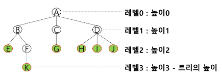

## 백트래킹

### 문제 제시: N-Queen 문제
- n*n 서양 장기판에서 배치한 Queen들이 서로 위협하지 않도록 n개의 Queen을 배치하는 문제
    - 어떤 두 Queen도 서로 위협하지 않아야 한다.
    - Queen을 배치한 n개의 위치는?

### 백트래킹(Backtracking) 개념
- 여러 가지 선택지(옵션)들이 존재하는 상황에서 한가지를 선택한다.
- 선택이 이루어지면 새로운 선택지들의 집합이 생성된다.
- 이런 선택을 반복하면서 최종 상태에 도달한다
    - 올바른 선택을 계속하면 목표 상태(goal state)에 도달한다.
- 당첨 리프 노드 찾기
    - 루트에서 갈 수 있는 노드를 선택한다.
    - 꽝 노드까지 도달하면 최근의 선택으로 되돌아와서 다시 시작한다.
    - 더 이상의 선택지가 없다면 이전의 선택지로 돌아가서 다른 선택을 한다.
    - 루트까지 돌아갔을 경우 더 이상 선택지가 없다면 찾는 답이 없다.
- 백트래킹과 깊이 우선 탐색과의 차이
    - 어떤 노드에서 출발하는 경로가 해결책으로 이어질 것 같이 않으면 더 이상 그 경로를 따라가지 않음으로써 시도의 횟수를 줄임. (Prunning 가지치기)
    - 깊이 우선 탐색이 모든 경로를 추적하는데 비해 백트래킹은 불필요한 경로를 조기에 차단.
    - 깊이 우선 탐색을 가하기에는 경우의 수가 너무나 많음. 즉, N! 가지의 경우의 수를 가진 문제에 대해 깊이 우선 탐색을 가하면 당연히 처리 불가능한 문제.
    - ★ 백트래킹 알고리즘을 적용하면 일반적으로 경우의 수가 줄어들지만 이 역시 최악의 경우에는 여전히 지수함수 시간(Exponential Time)을 요하므로 처리 불가능
- 8-Queens 문제
    - 퀸 8개를 크기의 체스판 안에 서로를 공격할 수 없도록 배치하는 모든 경우를 구하는 문제
- 후보 해의 수 : 64C8 = 64!/8!(64-8)! = 4,426,165,368
- 실제 해의 수 : 이 중에서 실제 해는 92개뿐
- 즉, 44억 개가 넘는 후보 해의 수 속에서 92개를 최대한 효율적으로 찾아내는 것이 관건
- 4-Queens 문제로 축소해서 생각해 보자
    - 같은 행에 위치할 수 없다.
    - 모든 경우의 수 : 4 * 4 * 4 * 4 = 256
- 루트 노드에서 리프(leaf) 노드까지의 경로는 해답후보(candidate solution)가 되는데, 깊이 우선 검색을 하여 그 해답후보 중에서 해답을 찾을 수 있다.
- 그러나 이 방법을 사용하면 해답이 될 가능성이 전혀 없는 노드의 후손 노드(descendant)들도 모두 검색해야 하므로 비효율적이다.
- 모든 후보를 검사?
    - No!
- 백트래킹 기법
    - 어떤 노드의 유망성을 점검한 후에 유망(promising)하지 않다고 결정되면 그 노드의 부모로 되돌아가(backtracking) 다음 자식 노드로 감.
    - 어떤 노드를 방문하였을 때 그 노드를 포함한 경로가 해답이 될 수 없으면 그 노드는 유망하지 않다고 하며, 반대로 해답의 가능성이 있으면 유망하다고 한다.
    - 가지치기(prunning): 유망하지 않는 노드가 포함되는 경로는 더 이상 고려하지 않는다.
- 백트래킹을 이용한 알고리즘은 다음과 같은 절차로 진행된다.
    1) 상태 공간 트리의 깊이 우선 검색을 실시한다.
    2) 각 노드가 유망한지를 점검한다.
    3) 만일 그 노드가 유망하지 않으면, 그 노드의 부모 노드로 돌아가서 검색을 계속한다.
- 일반 백트래킹 알고리즘
```
checknode (node v)
    IF promising(v)
        IF there is a solution at v
            write the solution
        ELSE
            FOR each child u of v
                checknode(u)
```
- 깊이 우선 검색 vs 백트래킹
    - 순수한 깊이 우선 검색 = 155 노드
    - 백트래킹 = 27 노드

### 상태공간트리를 구축하여 문제를 해결
```
bool backtrack(선택 집합, 선택한 수, 모든 선택수)
{
    if (선택한 수 == 모든 선택수)   // 더 이상 탐색할 노드가 없다.
    {
        찾는 솔루션인지 체크;
        return 결과;
    }

    현재 선택한 상태집합에 포함되지 않는 후보 선택들(노드) 생성

    모든 후보 선택들에 대해
    {
        선택 집합에 하나의 후보선택을 추가
        선택한 수 = 선택한 수 + 1
        결과 = backtrack 호출(선택집합, 선택한 수, 모든 선택수)

        if (결과 == 성공)
            return 성공;    // 성공한 경우 상위로 전달
    }
    return 실패;
}
```
- {1, 2, 3}의 powerset을 구하는 백트래킹 알고리즘
```
backtrack(a[], k, input)
    c[MAXCANDIDATES]
    ncands

    IF k == input: process_solution(a[], k)
    ELSE
        k++
        make_candidates(a[], k, input, c[], ncands)
        FOR i in 0 -> ncands - 1
            a[k] <- c[i]
            backtrack(a, k, input)

main()
    a[MAX]              // powerset을 저장할 배열
    backtrack(a[], 0, 3)    // 3개의 원소를 가지는 powerset
```
```
# {1, 2, 3} 집합에서 3개의 숫자를 선택하는 기본적인 예제
# 이미 사용한 숫자는 사용하지 않도록

arr = [i for i in range(1, 4)]
path = [0] * 3

def backtracking(cnt):
    # 기저 조건
    # 숫자 3개를 골랐을 때 종료
    if cnt == 3:
        print(*path)
        return
    
    for num in arr:
        # ☆가지치기 - 중복된 숫자 제거
        # 조건을 작성하는 것이 핵심
        if num in path:
            continue
        # 들어가기 전 로직 - 경로 저장
        path[cnt] = num
        # 다음 재귀 함수 호출
        backtracking(cnt + 1)
        # ☆돌아와서 할 로직
        path[cnt] = 0
    
backtracking(0)
```


## 트리

### 문제 제시 : 계산기
- 수식 2 + 3 * 4를 다음과 같은 그래프로 표현하고 그래프를 순회하여 수식을 계산하시오.

### 트리(tree)
- 트리는 싸이클이 없는 무향 연결 그래프이다.
    - 두 노드(or 정점) 사이에는 유일한 경로가 존재한다.
    - 각 노드는 최대 하나의 부모 노드가 존재할 수 있다.
    - 각 노드는 자식 노드가 없거나 하나 이상이 존재할 수 있다.
- 비선형 구조
    - 원소들 간에 1:n 관계를 가지는 자료구조
    - 원소들 간에 계층관계를 가지는 계층형 자료구조

### 트리 정의
- 한 개 이상의 노드로 이루어진 유한 집합이며 다음 조건을 만족한다.
    1) 노드 중 부모가 없는 노드를 루트(root)라 한다.
    2) 나머지 노드들은 n(>=0)개의 분리 집합 T1, ..., TN으로 분리될 수 있다.
- 이들 T1, ..., TN은 각각 하나의 트리가 되며(재귀적 정의) 루트의 서브 트리(subtree)라 한다.

### 트리 용어

- 노드(node): 트리의 원소이고 정점(vertex)이라고도 한다.
    - 트리 T의 노드 - A, B, C, D, E, F, G, H, I, J, K
- 간선(edge): 노드를 연결하는 선.
    - 부모 노드와 자식 노드를 연결
- 루트 노드(root node): 트리의 시작 노드
    - 트리 T의 루트 노드 - A
- 형제 노드(sibling node) : 같은 부모 노드의 자식 노드들
    - B, C, D는 형제 노드
- 조상 노드 : 간선을 따라 루트 노드까지 이르는 경로에 있는 모든 노드들
    - K의 조상 노드 : F, B, A
- 서브 트리(subtree) : 부모 노드와 연결된 간선을 끊었을 때 생성되는 트리
- 자손 노드 : 서브 트리에 있는 하위 레벨의 노드들
    - B의 자손 노드 - E, F, K
- 차수
    - 노드의 차수: 노드에 연결된 자식 노드의 수.
        - B의 차수 = 2, C의 차수 = 1
    - 트리의 차수 : 트리에 있는 노드의 차수 중에서 가장 큰 값
        - 트리 T의 차수 = 3
    - 단말 노드(리프 노드) : 차수가 0인 노드. 자식 노드가 없는 노드
- 높이
    - 노드의 높이 : 루트에서 노드에 이르는 간선의 수, 노드의 레벨
        - B의 높이 = 1, F의 높이 = 2
    - 트리의 높이 : 트리에 있는 노드의 높이 중에서 가장 큰 값. 최대 레벨
        - 트리 T의 높이 = 3

### 연습문제3 - 트리 순회
- 첫 줄에는 트리의 노드의 총 수 V가 주어진다. 그 다음 줄에는 V-1개 간선이 나열된다. 간선은 그것을 이루는 두 정점으로 표기된다. 간선은 항상 "부모 자식"순서로 표기된다.
- 아래 예에서 두 번째 줄 처음 1 2는 정점 1과 2를 잇는 간선을 의미하며 1이 부모, 2가 자식을 의미한다. 간선은 부모 정점 번호가 작은 것부터 나열되고, 부모 정점이 동일하다면 자식 정점 번호가 작은 것부터 나열된다.
    - 12 <- 간선의 수
    - 1 2 1 3 2 4 3 5 3 6 4 7 5 8 5 9 6 10 6 11 7 12 11 13
- 이진 트리를 전/중/후위 순회하고 방문한 노드의 번호를 출력하시오.

```
# 0. 이진 트리 저장
#   - 일차원 배열 저장
# 1. 연결 리스트로 저장 - 개발용
class TreeNode:
    def __init__(self, value):
        self.value = value
        self.left = None
        self.right = None

    # 삽입 함수
    def insert(self, childNode):
        # 왼쪽 자식이 없을 경우
        if not self.left:
            self.left = childNode
            return
        
        # 오른쪽 자식이 없을 경우
        if not self.right:
            self.right = childNode
            return
    
    return

    def preorder(self):
        # 아무것도 없는 트리를 조회할 때
        if self != None:
            # 전위 순회
            # print(self.value, end=' ')
            # 왼쪽이 있다면 왼쪽 자식 조회
            if self.left:
                self.left.preorder()

            # 중위 순회
            # print(self.value, end=' ')
            
            # 오른쪽이 있다면 왼쪽 자식 조회
            if self.right:
                self.right.preorder()
            
            # 후위 순회
            # print(self.value, end=' ')
    
arr = [1, 2, 1, 3, 2, 4, 3, 5, 3, 6]
# 이진 트리 만들기
nodes = [TreeNode(i) for i in range(1, 7)]
for i in range(0, len(arr), 2):
    parentNode = arr[i]
    childNode = arr[i + 1]
    nodes[parentNode].insert(nodes[childNode])


# 2. 연결 리스트로 저장
```


## 수업자료
- https://edu.ssafy.com/data/upload_files/crossUpload/openLrn/ebook/unzip/A2023091511325656700/index.html
