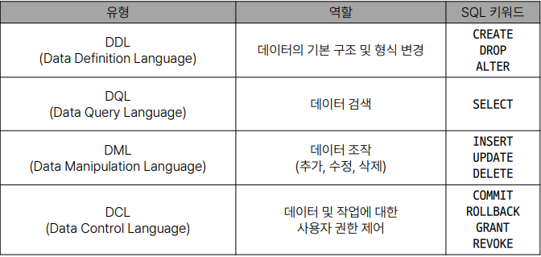

## 데이터베이스
- 체계적인 데이터 모음

### 데이터
- 저장이나 처리에 효율적인 형태로 변환된 정보

### 증가하는 데이터 사용량
- 매일 초당 2억 개의 메일이 전송되며, 3만명이 넷플릭스를 시청
- 배달의 민족 월평균 주문 약 6천만건 (2020)
- 전세계 모든 데이터의 약 90%는 2015년 이후 생산된 것 (IBM)

### 데이터 센터의 성장
- 카카오 - 제1데이터센터와 제2데이터센터에 1.5조 투자 (2022)
- 네이버 - 제2데이터센터에 6500억 투자 (2020)
- 전 세계 데이터 센터 시장 2022년부터 2026년까지 연평균 20% 이상 성장 예상

### 데이터를 저장하고 잘 관리하여 활용할 수 있는 기술이 중요해짐
- 우리가 알고 있는 데이터 저장 방식은 어떤 것이 있을까?

### 기존의 데이터 저장 방식
1. 파일(File) 이용
2. 스프레드 시트(Spreadsheet) 이용

### 파일을 이용한 데이터 관리
- 어디에서나 쉽게 사용 가능
- 데이터를 구조적으로 관리하기 어려움

### 스프레드 시트를 이용한 데이터 관리
- 테이블의 열과 행을 사용해 데이터를 구조적으로 관리 가능

### 스프레드 시트의 한계
- 크기: 일반적으로 약 100만 행까지만 저장가능
- 보안: 단순히 파일이나 링크 소유 여부에 따른 접근 권한 기능 제공
- 정확성
    - 만약 공식적으로 "강원"의 지명이 "강언"으로 바뀌었다고 가정한다면?
    - 이 변경으로 인해 테이블 모든 위치에서 해당 값을 업데이트 해야함
    - 찾기 및 바꾸기 기능을 사용해 바꿀 수 있지만 만약 데이터가 여러 시트에 분산되어 있다면 변경에 누락이 생기거나 추가 문제가 생길 수 있음


## Relational Database

### 데이터베이스 역할
- 데이터를 저장하고 조작, CRUD

### 관계형 데이터베이스
- 데이터 간에 관계가 있는 데이터 항목들의 모음
- 테이블, 행, 열의 정보를 구조화하는 방식
- **서로 관련된 데이터 포인터를 저장**하고 이에 대한 **액세스**를 제공
- 이 관계로 인해 두 테이블을 사용하여 데이터를 다양한 형식으로 조회할 수 있음
    - 특정 날짜에 구매한 모든 고객 조회
    - 지난 달에 배송일이 지연된 고객 조회 등

### 관계
- 여러 테이블 간의 (논리적) 연결

### 관계형 데이터베이스 예시
- 다음과 같이 고객 데이터가 테이블에 저장되어 있다고 가정
- 고객 데이터 간 비교를 위해서는 어떤 값을 활용해야 할까?
    - 이름? 주소? 만약 동명이인이나 같은 주소지가 있다면?
    - 각 데이터에 고유한 식별 값을 부여하기 (기본 키, Primary Key)
- 누가 어떤 주문을 했는지 어떻게 식별할 수 있을까?
    - 고객 이름? 마찬가지로 동명이인이 있다면?
    - 고객의 고유한 식별 값을 저장하자 (외래 키, Foreign Key)

### 관계형 데이터베이스 관련 키워드
1. Table (aka Relation)
    - 데이터를 기록하는 곳
2. Field (aka Column, Attribute)
    - 각 필드에는 고유한 데이터 형식(타입)이 지정됨
3. Record (aka Row, Tuple)
    - 각 레코드에는 구체적인 데이터 값이 저장됨
4. Database (aka Schema)
    - 테이블의 집합
5. Primary Key (기본 키)
    - 각 레코드의 고유한 값
    - 관계형 데이터베이스에서 **레코드의 식별자**로 활용
6. Foreign Key(외래키)
    - 테이블의 필드 중 다른 테이블의 레코드를 식별할 수 있는 키
    - 다른 테이블의 기본 키를 참조
    - 각 레코드에서 서로 다른 테이블 간의 **관계를 만드는 데** 사용


## RDBMS

### DBMS, Database Management System
- 데이터 저장 및 관리를 용이하게 하는 시스템
- 데이터베이스와 사용자 간의 인터페이스 역할
- 사용자가 데이터 구성, 업데이트, 모니터링, 백업, 복구 등을 할 수 있도록 도움

### RDBMS, Relational Database Management System
- 관계형 데이터베이스를 관리하는 소프트웨어 프로그램

### SQLite
- 경량의 오픈 소스 데이터베이스 관리 시스템
- 컴퓨터나 모바일 기기에 내장되어 간단하고 효율적인 데이터 저장 및 관리를 제공

### 데이터베이스 정리
- Table은 데이터가 기록되는 곳
- Table에는 행에서 고유하게 식별 가능한 기본 키라는 속성이 있으며, 외래키를 사용하여 각 행에서 서로 다른 테이블 간의 관계를 만들 수 있음
- 데이터는 기본 키 또는 외래 키를 통해 결합(join)될 수 있는 여러 테이블에 걸쳐 구조화 됨


## SQL, Structure Query Language
- 데이터베이스에 정보를 저장하고 처리하기 위한 프로그래밍 언어
- 테이블의 형태로 구조화된 관계형 데이터베이스 에게 요청을 질의(요청)

### SQL Syntax
```
SELECT column_name FROM table_name;
```
- SQL 키워드는 대소문자를 구분하지 않음
    - 하지만 대문자로 작성하는 것을 권장 (명시적 구분)
- 각 SQL Statements의 끝에는 세미콜론(;)이 필요
    - 세미콜론은 각 SQL Statements을 구분하는 방법 (명령어의 마침표)

### SQL Statements
- SQL을 구성하는 가장 기본적인 코드 블록

### SQL Statements 예시
```
SELECT column_name FROM table_name;
```
- 해당 예시 코드는 SELECT Statements라 부름
- 이 Statement는 SELECT, FROM 2개의 keyword로

### 수행 목적에 따른 SQL Statements 4가지 유형


### SQL 학습
- 단순히 SQL 문법을 암기하고 상황에 따라 실행만 하는 것이 아닌 SQL을 통해 관계형 데이터베이스를 잘 이해하고 다루는 방법을 학습

## [참고]

### Query
- "데이터베이스로부터 정보를 요청" 하는 것
- 일반적으로 SQL로 작성하는 코드를 쿼리문(SQL문)이라 함

### SQL 표준
- SQL은 미국 국립 표준 협회(ANSI)와 국제 표준화 기구(ISO)에 의해 표준이 채택됨
- 모든 RDBMS에서 SQL 표준을 지원
- 다만 각 RDBMS마다 독자적인 기능에 따라 표준을 벗어나는 문법이 존재하니 주의


## Single Table Queries

## Querying Data

### SELECT statement
- 테이블에서 데이터를 조회
```
SELECT
    select_list
FROM
    table_name;
```
- SELECT 키워드 이후 데이터를 선택하려는 필드를 하나 이상 지정
- FROM 키워드 이후 데이터를 선택하려는 테이블의 이름을 지정

### SELECT 정리
- SELECT 문을 사용하여 테이블의 데이터를 조회 및 반환
- '*' (asterisk)를 사용하여 모든 필드 선택


## Sorting data

### ORDER BY
- 조회 결과의 레코드를 정렬
```
ORDER BY
    column1 [ASC|DESC],
    column2 [ASC|DESC],
    ...;
```
- FROM clause 뒤에 위치
- 하나 이상의 컬럼을 기준으로 결과를 오름차순(ASC, 기본 값), 내림차순(DESC)으로 정렬

### 정렬에서의 NULL
- NULL 값이 존재할 경우 오른차순 정렬 시 결과에 NULL이 먼저 출력

### SELECT statement 실행 순서
1. 테이블에서 (FROM)
2. 조회하여 (SELECT)
3. 정렬 (ORDER BY)


## Filtering data

### DISTINCT statement
- 조회 결과에서 중복된 레코드를 제거
```
SELECT DISTINCT
    select_list
FROM
    table_name;
```
- SELECT 키워드 바로 뒤에 작성해야 함
- SELECT DISTINCT 키워드 다음에 고유한 값을 선택하려는 하나 이상의 필드를 지정


### WHERE
- 조회 시 특정 검색 조건을 지정
```
WHERE
    search_condition;
```
- FROM clause 뒤에 위치
- search_condition은 비교연산자 및 논리연산자(AND, OR, NOT 등)를 사용하는 구문이 사용됨


## Operators

### Comparison Operators
- 비교 연선자
- =, >=, <=, !=, IS, LIKE, IN, BETWEEN...AND

### Logical Operators
- 논리 연산자
- AND(&&), OR(||), NOT(!)

### IN Operator
- 값이 특정 목록 안에 있는지 확인

### LIKE Opeator
- 값이 특정 패턴에 일치하는지 확인
- (Wildcards와 함께 사용)

### Wildcard Characters
- '%': 0개 이상의 문자열과 일치 하는지 확인
- '_': 단일 문자와 일치하는지 확인

### LIMIT
- 조회하는 레코드 수를 제한
```
LIMIT [offset,] row_count;
```
- 하나 또는 두 개의 인자를 사용(0 또는 양의 정수)
- row_count는 조회하는 최대 레코드 수를 지정


## Grouping data

### GROUP BY
- 레코드를 그룹화하여 요약본 생성('집계 함수'와 함께 사용)

### Aggregation Functions, 집계 함수
- 값에 대한 계산을 수행하고 단일한 값을 반환하는 함수
- SUM, AVG, MAX, MIN, COUNT


## Managing Tables

### CREATE TABLE
- 테이블 생성
```
CREATE TABLE table_name (
    column_1 data_type constraints,
    column_2 data_type constraints,
    ...,
);
```
- 각 필드에 적용할 데이터 타입 작성
- 테이블 및 필드에 대한 제약조건(constraints) 작성
```
-- 테이블 스키마(구조) 확인
PRAGMA table_info('examples');
```

### SQLite 데이터 타입
1. NULL - 아무런 값도 포함하지 않음을 나타냄
2. INTEGER - 정수
3. REAL - 부동 소수점
4. TEXT - 문자열
5. BLOB - 이미지, 동영상, 문서 등의 바이너리 데이터

### Constraints, 제약 조건
- 테이블의 필드에 적용되는 규칙 또는 제한 사항
- 데이터의 무결성을 유지하고 데이터베이스의 일관성을 보장

### 대표적인 제약 조건
- PRIMARY KEY
    - 해당 필드를 기본 키로 지정
    - INTEGER 타입에만 적용되며 INT, BIGINT등과 같은 정수 유형은 적용되지 않음
- NOT NULL
    - 해당 필드에 NULL 값을 허용하지 않도록 지정
- FOREIGN KEY
    - 다른테이블과의 외래 키 관계를 정의

### AUTOINCREMENT
- 자동으로 고유한 정수 값을 생성하고 할당하는 필드 속성
- 필드의 자동 증가를 나타내는 특수한 키워드
- 주로 primary key 필드에 적용
- INTEGER PRIMARY KEY AUTOINCREMENT가 작성된 필드는 항상 새로운 레코드에 대해 이전 최대 값보다 큰 값을 할당
- 삭제된 값은 무시되며 재사용할 수 없게 됨


## Modifying table fields

### ALTER TABLE
|명령어|역할|
|:---|:---:|
|ALTER TABLE ADD COLUMN|필드 추가|
|ALTER TABLE RENAME COLUMN|필드 이름 변경|
|ALTER TABLE DROP COLUMN|필드 삭제|
|ALTER TABLE RENAME TO|테이블 이름 변경|

```
CREATE TABLE examples (
    ExamId INTEGER PRIMARY KEY AUTOINCREMENT,
    LastName VARCHAR(50) NOT NULL,
    FirstName VARCHAR(50) NOT NULL
);

-- 테이블 생성

PRAGMA table_info('examples');

-- 테이블 구조 (sqlite3용)
-- cid -> 컬럼 아이디

ALTER TABLE
    examples
ADD COLUMN
    Country VARCHAR(50) NOT NULL;


ALTER TABLE
    examples
ADD COLUMN
    Age INTEGER NOT NULL;

ALTER TABLE
    examples
ADD COLUMN
    Address VARCHAR(50) NOT NULL;


ALTER TABLE
    examples
RENAME COLUMN Address TO PostCode;


ALTER TABLE
    examples
DROP COLUMN PostCode;


ALTER TABLE examples
RENAME TO new_exmaples;


DROP TABLE new_exmaples;
```


## Modifying Data

### INSERT
- 테이블 레코드 삽입
```
INSERT INTO table_name (c1, c2, ...)
VALUES (v1, v2, ...);
```


## Update Data

### UPDATE
- 테이블 레코드 수정
```
UPDATE table_name
SET column_name = expression,
[WHERE
    condition];
```
- SET절 다음에 수정 할 필드와 새 값을 지정
- WHERE 절에서 수정 할 레코드를 지정하는 조건 작성
- WHERE 절을 작성하지 않으면 모든 레코드를 수정

## DELETE data

### DELETE
- 테이블 레코드 삭제
```
DELETE FROM table_name
[WHERE
    condition];
```
- DELETE FROM 절 다음에 테이블 이름 작성
- WHERE 절에서 삭제할 레코드를 지정하는 조건 작성
- WHERE 절을 작성하지 않으면 모든 레코드를 삭제


## 수업자료
- https://edu.ssafy.com/data/upload_files/crossUpload/openLrn/ebook/unzip/A2023101010025743400/index.html