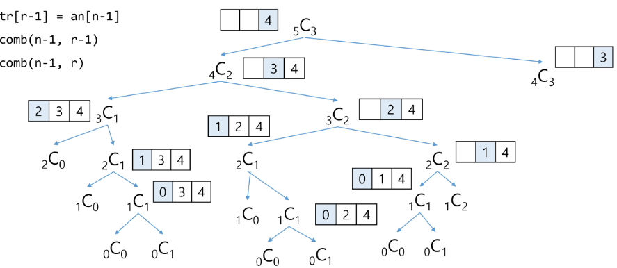
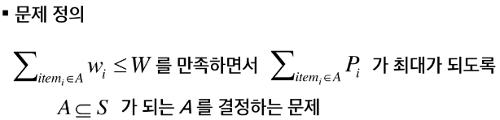

## 조합
- 서로 다른 n개의 원소 중 r개를 순서 없이 골라낸 것을 조합(combination)이라고 부른다.
- 조합의 수식
    ```
    nCr = n!/(n-r)!r!, (n>=r)
    nCr = (n-1)C(r-1) + (n-1)Cr # 재귀적 표현
    nC0 = 1
    ```

### 재귀 호출을 이용한 조합 생성 알고리즘
```
an[] : n개의 원소를 가지고 있는 배열
tr[] : r개의 크기의 배열, 조합이 임시 저장될 배열

comb(n, r)
    if (r == 0) print_arr()
    else if (n < r) return
    else
        tr[r-1] = an[n-1]
        comb(n-1, r-1)
        comb(n-1, r)
```
### [참고]
- 재귀 호출을 이용한 조합 생성 알고리즘

- 10개의 원소 중 3개를 고르는 조합
    - i < j < k 라고 하면,
    ```
    for i : 0 -> 7              # j, k로 선택될 원소를 남김
        for j : i+1 -> 8        # k로 선택될 원소를 남김
            for k : j+1 -> 9
                f(a[i], a[j], a[k])
    ```
- n개에서 r개를 고르는 조합 (재귀)
    ```
    def nCr(n,r,s): # n개에서 r개를 고르는 조합, s 선택할 수 있는 구간의 시작
        if r==0:
            print(*comb)
        else:
            for i in range(s, n-r+1):
                comb[r-1] = A[i]
                nCr(n, r-1, i+1)
    ```

```
def nCr(n, r, s):   # n개에서 r개를 고르는 조합, s 선택할 수 있는 구간의 시작
    if r == 0:
        print(*comb)
    elif n<r:   # 남은 원소보다 많은 원소를 선택해야하는 경우
        return  # 불가
    else:
        tr[r-1] = a[n-1]    # a[n-1] 조합에 포함시키는 경우
        nCr(n-1, r-1)
        nCr(n-1, r)         # a[n-1] 을 포함시키지 않는 경우
```

### <연습문제3>
- 부분집합 합 문제 구현하기
    - 아래의 10개의 정수 집합에 대한 모든 부분 집합 중 원소의 합이 0이 되는 부분집합을 모두 출력하시오.
        - 예> {-1, 3, -9, 6, 7, -6, 1, 5, 4, -2}

```
arr = [-1, 3, -9, 6, 7, -6, 1, 5, 4, -2]
N = len(arr)

def subset(i, N):
    if i == N:
        s = 0
        for j in range(N):
             if bit[j]:
                s += arr[j]
        if s == 0:
            for j in range(N):
                if bit[j]:
                    print(arr[j], end = ' ')
            print()
    else:
        bit[i] = 1
        subset(i+1, N)
        bit[i] = 0
        subset(i+1, N)
    return
```

## 탐욕(Greedy) 알고리즘
- 탐욕 알고리즘은 최적해를 구하는 데 사용되는 근시안적인 방법
- 일반적으로, 머리속에 떠오르는 생각을 검증 없이 바로 구현하면 Greedy 접근이 된다.
- 여러 경우 중 하나를 선택 할 때마다 그 순간에 최적이라고 생각되는 것을 선택해 나가는 방식으로 진행하여 최종적인 해답에 도달한다.
- 각 선택 시점에서 이루어지는 결정은 지역적으로는 최적이지만, 그 선택들을 계속 수집하여 최종적인 해답을 만들었다고 하여, **그것이 최적이라는 보장은 없다.**
- 일단, 한번 선택된 것은 번복하지 않는다. 이런 특성 때문에 대부분의 탐욕 알고리즘들은 단순하며, 또한 제한적인 문제들에 적용된다.
- 최적화 문제(optimization)란 가능한 해들 중에서 가장 좋은(최대 또는 최소) 해를 찾는 문제이다.

### 탐욕 알고리즘의 동작 과정
1) 해 선택: 현재 상태에서 부분 문제의 최적 해를 구한 뒤, 이를 부분해 집합(Solution Set)에 추가한다.
2) 실행 가능성 검사 : 새로운 부분 해 집합이 실행가능한지를 확인한다. 곧, 문제의 제약 조건을 위반하지 않는 지를 검사한다.
3) 해 검사 : 새로운 부분 해 집합이 문제의 해가 되는지를 확인한다. 아직 전체 문제의 해가 완성되지 않았다면 1의 해 선택부터 다시 시작한다.
- 탐욕 기법을 적용한 거스름돈 줄이기
    1) 해 선택: 여기에서는 멀리 내다볼 것 없이 가장 좋은 해를 선택한다. 단위가 큰 동전으로만 거스름돈을 만들면 동전의 개수가 줄어들므로 현재 고를 수 있는 가장 단위가 큰 동전을 하나 골라 거스름돈에 추가한다.
    2) 실행 가능성 검사 : 거스름돈이 손님에게 내드려야 할 액수를 초과하는지 확인한다. 초과한다면 마지막에 추가한 동전을 거스름돈에서 빼고, 1로 돌아가서 현재보다 한 단계 작은 단위의 동전을 추가한다.
    3) 해 검사 : 거스름돈 문제의 해는 당연히 거스름돈이 손님에게 내드려야 하는 액수와 일치하는 셈이다. 더 드려도, 덜 드려도 안되기 때문에 거스름돈을 확인해서 액수에 모자라면 다시 1로 돌아가서 거스름돈에 추가할 동전을 고른다.

## 배낭 짐싸기(Knapsack)
- 도둑은 부자들의 값진 물건들을 훔치기 위해 보관 창고에 침입하였다.
- 도둑은 훔친 물건을 배낭에 담아 올 계획이다. 배낭은 담을 수 있는 물건의 총 무게(W)가 정해져 있다.
- 창고에는 여러 개(n개)의 물건들이 있고 각각의 물건에는 무게와 값이 정해져 있다.
- 경비원들에 발각되기 전에 배낭이 수용할 수 있는 무게를 초과하지 않으면서, 값이 최대가 되는 물건들을 담아야 한다.

### Knapsack 문제의 정형적 정의
- S = {item1, item2, ... itemn}, 물건들의 집합
- wi : itemi의 무게, Pi = itemi의 값
- W : 배낭이 수용가능 한 총 무게


### Knapsack 문제 유형
- 0-1 Knapsack
    - 배낭에 물건을 통째로 담아야 하는 문제.
    - 물건을 쪼갤 수 없는 경우.
- Fractional Knapsack
    - 물건을 부분적으로 담는 것이 허용되는 문제.
    - 물건을 쪼갤 수 있는 경우.

### 0-1 Knapsack에 대한 완전 검색 방법
- 완전 검색으로 물건들의 집합 S에 대한 모든 부분집합을 구한다.
- 부분집합의 총무게가 W를 초과하는 집합들은 버리고, 나머지 집합에서 총 값이 가장 큰 집합을 선택할 수 있다.
- 물건의 개수가 증가하면 시간 복잡도가 지수적으로 증가한다.
    - 크기 n인 부분합의 수 2^n

## 활동 선택 문제

### 회의실 배정하기
- 김대리는 소프트웨어 개발팀들의 회의실 사용 신청을 처리하는 업무를 한다. 이번 주 금요일에 사용 가능한 회의실은 하나만 존재하고 다수의 회의가 신청된 상태이다.
- 회의는 시작 시간과 종료 시간이 있으며, 회의 시간의 겹치는 회의들은 동시에 열릴 수 없다.
- 가능한 많은 회의가 열리기 위해서는 회의들을 어떻게 배정해야 할까?
- 입력 예
    - 회의 개수
    - (시작시간, 종료 시간)

