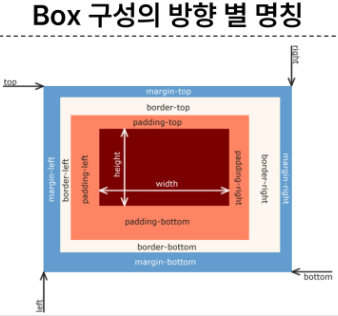
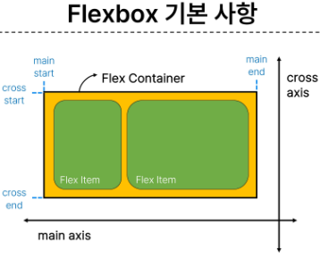

## CSS Box Model

### CSS Box Model
- 모든 HTML 요소를 사각형 박스로 표현하는 개념

## 구성요소

### CSS Box Model
- 모든 HTML 요소를 사각형 박스로 표현하는 개념
- 내용(content), 안쪽 여백(padding), 테두리(border), 외부 간격(margin)으로 구성되는 개념

### Box 구성 요소
- Margin : 이 박스와 다른 요소 사이의 공백, 가장 바깥쪽 영역
- Border : 콘텐츠와 패딩을 감싸는 테두리 영역
- Padding : 콘텐츠 주위에 위치하는 공백 영역
- Content : 콘텐츠가 표시되는 영역

### width &  height 속성
- 요소의 너비와 높이를 지정
- 이때 지정되는 요소의 너비와 높이는 콘텐츠 영역을 대상으로 함

### CSS가 width 값을 계산하는 기준
- CSS는 border가 아닌 content의 크기를 width 값으로 지정

## 박스 타입

### Normal flow
- CSS를 적용하지 않았을 경우 웹페이지 요소가 기본적으로 배치되는 방향

### block 타입 특징
- 항상 새로운 행으로 나뉨
- width와 height 속성을 사용하여 너비와 높이를 지정할 수 있음
- 기본적으로 width 속성을 지정하지 않으면 박스는 inline 방향으로 사용 가능한 공간을 모두 차지함  (너비를 사용가능한 공간의 100%로 채우는 것)
- 대표적인 block 타입 태그
    - h1~6, p, div

### inline 타입 특징
- 새로운 행으로 나뉘지 않음
- width와 height 속성을 사용할 수 없음
- 수직 방향
    - padding, margins, borders가 적용되지만 다른 요소를 밀어낼 수 없음
- 수평 방향
    - padding, margins, borders가 적용되어 다른 요소를 밀어낼 수 있음
- 대표적은 inline 타입 태그
    - a, img, span

## 기타 display 속성

### 'inline-block'
- inline과 block 요소 사이의 중간 지점을 제공하는 display 값
- block 요소의 특징을 가짐
    - width 및 height 속성 사용 가능
    - padding, margin 및 border 로 인해 다른 요소가 밀려남
- 요소가 줄 바꿈 되는 것을 원하지 않으면서 너비와 높이를 적용하고 싶은 경우에 사용

### 'none'
- 요소를 화면에 표시하지 않고, 공간조차 부여되지 않음

 

# CSS Layout Position
- CSS Layout
    - 각 요소의 위치와 크기를 조정하여 웹 페이지의 디자인을 결정하는 것
    - display, position, float, flexbox 등

## CSS Position
- CSS Position
    - 요소를 Normal Flow에서 제거하여 다른 위치로 배치하는 것
    - 다른 요소 위에 올리기, 화면의 특정 위치에 고정시키기 등

### Position 이동 방향
- top, bottom, left, right, Z Axis

### Position 유형별 특징
- static
    - 기본값
    - 요소를 Normal Flow에 따라 배치
- relative
    - 요소를 Normal Flow에 따라 배치
    - 자기 자신을 기준으로 이동
    - 요소가 차지하는 공간은 static일 때와 같음
- absolute
    - 요소를 Normal Flow에서 제거
    - 가장 가까운 relative 부모 요소를 기준으로 이동
    - 문서에서 요소가 차지하는 공간이 없어짐
- fixed
    - 요소를 Normal Flow에서 제고
    - 현재 화면영역(viewport)을 기준으로 이동
    - 문서에서 요소가 차지하는 공간이 없어짐
- sticky
    - 요소를 Normal Flow에 따라 배치
    - 요소가 일반적인 문서 흐름에 따라 배치되다가 스크롤이 특정 임계점에 도달하면 그 위치에서 고정됨(fixed_)
    - 만약 다음 sticky 요소가 나오면 다음 sticky 요소가 이전 sticky 요소의 자리를 대체
        - 이전 sticky 요소가 고정되어 있던 위치와 다음 sticky 요소가 고정되어야 할 위치가 겹치게 되기 때문

### z-index
- 요소가 겹쳤을 때 어떤 요소 순으로 위에 나타낼 지 결정
- 정수 값을 사용해 Z축 순서를 지정
- 더 큰 값을 가진 요소가 작은 값의 요소를 덮음

 

# CSS Layout Flexbox

## CSS Flexbox
- 요소를 행과 열 형태로 배치하는 1차원 레이아웃 방식
- '공간 배열' & '정렬'

### Flexbox 기본 사항

- main axis(주 축)
    - flex item들이 배치되는 기본 축
    - main start에서 시작하여 main end 방향으로 배치
- cross axis (교차 축)
    - main axis에 수직인 축
    - cross start에서 시작하여 cross end 방향으로 배치
- Flex Container
    - display: Flex; 혹은 display: inline-flex; 가 설정된 부모 요소
    - 이 컨테이너의 1차 자식 요소들이 Flex Item이 됨
    - flexbox 속성 값들을 사용하여 자식 요소 Flex Item들을 배치
- Flex Item
    - Flex Container 내부에 레이아웃 되는 항목

## 레이아웃 구성

### 1. Flex Container 지정
- flex item은 기본적으로 행으로 나열
- flex item은 주축의 시작 선에서 시작
- flex item은 교차축의 크기를 채우기 위해 늘어남

### 2. flex-direction 지정
- flex item이 나열되는 방향을 지정
- column으로 지정할 경우 주 축이 변경됨
- -reverse로 지정하면 시작 선과 끝 선이 서로 바뀜

### 3. flex-wrap
- flex item 목록이 flex container의 하나의 행에 들어가지 않을 경우 다른 행에 배치할지 여부 설정

### 4. justify- content
- 주 축을 따라 flex item과 주위에 공간을 분배

### 5. align-content
- 교차 축을 따라 flex item과 주위에 공간을 분배
    - flex-wrap이 wrap 또는 wrap-reverse로 설정된 여러 행에만 적용됨
    - 한 줄 짜리 행에는 (flex-wrap이 nowrap으로 설정된 경우) 효과 없음

### 6. align-items
- 교차 축을 따라 flex item 행을 정령

### 7. align-self
- 교차 축을 따라 개별 flex item을 정렬

### Felxbox 속성
- Flex Container 관련 속성
    - display, flex-direction, flex-wrap, justify-content, align-items, align-content
- Flex Item 관련 속성
    - align-self, flex-grow, flex-basis, order