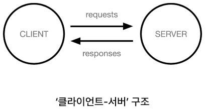

# Django Intro & Design Pattern

## Framework

### '웹 서비스 개발'에는 무엇이 필요할까?
- 로그인, 로그아웃, 회원관리, 데이터베이스, 보안 등.. 너무 많은 기술들이 필요
- 하지만 모든 걸 직접 만들 필요가 없음
- 잘 만들어진 것들을 가져와 좋은 환경에서 잘 사용하는 것도 능력인 시대

### Framework
- 웹 애플리케이션을 빠르게 개발할 수 있도록 도와주는 도구
- (개발에 필요한 기본 구조, 규칙, 라이브러리 등을 제공)

### 왜 프레임워크를 사용할까?
- 기본적인 구조, 도구, 규칙 등을 제공하기 때문에 개발자는 필수적인 해야 하는 핵심 개발에만 집중 할 수 있음
- 여러 라이브러리를 제공해 개발 속도를 빠르게 할 수 있음 (생산성)
- 유지보수와 확장에 용이해 소프트웨어의 품질을 높임


## Django framework

### django
- Python 기반의 대표적인 웹 프레임워크
- 2022 기준 가장 인기있는 백엔드 프레임워크
- (Stack overflow, github, hackerrank 통계 기반)
- 검증된 웹 프레임워크
- 대규모 서비스에서도 안정적인 서비스 제공


## 클라이언트와 서버

### 웹의 동작 방식
- 우리가 컴퓨터 혹은 모바일 기기로 웹 페이지를 보게 될 때까지 무슨 일이 일어날까?
- Client(클라이언트): 서비스를 요청하는 주체 (웹 사용자의 인터넷이 연결된 장치, 웹 브라우저)
- Server(서버): 클라이언트의 요청에 응답해주는 주체 (웹 페이지, 앱을 저장하는 컴퓨터)


### 우리가 웹 페이지를 보게 되는 과정
1. 웹 브라우저(클라이언트)에서 'google.com'을 입력
2. 브라우저는 인터넷에 연결된 전세계 어딘 가에 있는 구글 컴퓨터(서버)에게 'Google 홈페이지.html'파일을 달라고 요청
3. 요청을 받은 구글 컴퓨터는 데이터베이스에서 'Google 홈페이지.html' 파일을 찾아 응답
4. 전달받은 Google 홈페이지.html 파일을 웹 브라우저가 사람이 볼 수 있도록 해석해주면서 사용자는 구글의 메인 페이지를 보게 됨


## 프로젝트 및 가상환경

### 가상환경
- Python 애플리케이션과 그에 따른 패키지들을 격리하여 관리할 수 있는 **독립적인** 실행 환경

### 가상 환경이 필요한 시나리오 1
- 한 개발자가 2개의 프로젝트(A와 B)를 진행해야 한다.
- 프로젝트 A는 requests 패키지 버전 1을 사용해야 한다.
- 프로젝트 B는 requests 패키지 버전 2을 사용해야 한다.
- 하지만 파이썬 환경에서 패키지는 1개의 버전만 존재할 수 있다.
- A와 B 프로젝트 다른 패키지 버전 사용을 위한 독립적인 개발 환경이 필요하다.

### 가상 환경이 필요한 시나리오 2
- 한 개발자가 2개의 프로젝트(A와 B)를 진행해야 한다.
- 프로젝트 A는 water 패키지를 사용해야 한다.
- 프로젝트 B는 fire 패키지를 사용해야 한다.
- 하지만 파이썬 환경에서 water패키지와 fire 패키지를 함께 사용하면 충돌이 발생하기 때문에 설치할 수 없다.
- A와 B 프로젝트의 패키지 충돌을 피하기 위해 각각 **독립적인 개발 환경**이 필요하다.

### 가상환경 venv 생성
```
$ python -m venv venv
```

### 가상환경 활성화
```
$ source venv/Scripts/activate
```

### 환경에 설치된 패키지 목록 확인
```
$ pip list
```

### 패키지 목록이 필요한 시나리오
- 만약 2명(A와 B)의 개발자가 하나의 프로젝트를 함께 개발한다고 하자.
- 팀원 A가 먼저 가상환경을 생성 후 프로젝트를 설정하고 관련된 패키지를 설치하고 개발하다가 협업을 위해 github에 프로젝트를 push 한다.
- 팀원 B는 해당 프로젝트를 clone 받고 실행해보려 하지만 실행되지 않는다.
- 팀원 A가 이 프로젝트를 위해 어떤 패키지를 설치했고, 어떤 버전을 설치 했는지 A의 가상환경 상황을 알 수 없다.
- 가상환경에 대한 모습 즉 **패키지 목록**이 공유되어야 한다.

### 의존성 패키지
- 한 소프트웨어 패키지가 다른 패키지의 기능이나 코드를 사용하기 때문에 그 패키지가 존재해야만 제대로 작동하는 관계
- 사용하려는 패키지가 설치되지 않았거나, 호환되는 버전이 아니면 오류가 발생하거나 예상치 못한 동작을 보일 수 있음
- requests 설치 후 설치되는 패키지 목록 변화(1개만 설치되는 것이 아님)

### 의존선 패키지 관리의 중요성
- 개발 환경에서는 각각의 프로젝트가 사용하는 패키지와 그 버전을 정확히 관리하는 것이 중요

### 의존성 패키지 목록 생성
```
$ pip frezze > requirements.txt
```

### Django 프로젝트 생성 전 루틴
```
# 1. 가상환경 생성
$ python -m venv venv
# 2. 가상환경 활성화
$ source venv/Scripts/activate
# 3. Django 설치
$ pip install Django
# 4. 의존성 파일 생성
$ pip freeze > requirements.txt
```
### Django 프로젝트 생성
```
$ django-admin startproject firstpjt .
```

### Django 서버 실행 
```
$ python manage.py runserver
```

## 참고

### Django 프로젝트 생성 루틴 정리 + git
1. 가상환경 생성
2. 가상환경 활성화
3. Django 설치
4. 의존성 파일 생성(패키지 설치시마다 진행)
5. .gitignore 파일 생성 (첫 add 전)
6. git 저장소 생성
7. Django 프로젝트 생성

### 가상환경을 사용하는 이유
- 의존성 관리
    - 라이브러리 및 패키지를 각 프로젝트마다 독립적으로 사용 가능
- 팀 프로젝트 협업
    - 모든 팀원이 동일한 환경과 의존성 위에서 작업하여 버전간 충돌을 방지


## Django 프로젝트와 앱

### Django project
- 애플리케이션의 집합
- (DB 설정, URL 연결, 전체 앱 설정 등을 처리)

### Django application
- 독립적으로 작동하는 기능 단위 모듈
- (각자 특정한 기능을 담당하며 다른 앱들과 함께 하나의 프로젝트를 구성)

### 만약 커뮤니티 카페를 만든다면
- 프로젝트: 카페(전체 설정 담당)
- 앱: 게시글, 댓글, 회원 관리 등(DB, 로직, 화면)

### 앱 사용 과정
1. 앱 생성
2. 앱 등록

### 앱 생성
- 앱의 이름은 '복수형'으로 지정하는 것을 권장
```
$ python manage.py startapp articles
```

### 앱 등록
- **반드시 앱을 생성한 후에 등록해야 함**
- **등록 후 생성은 불가능**
```
INSTALLED_APPS = [
    'articles',
    'django.contrib.admin',
    'django.contrib.auth',
    'django.contrib.contenttypes',
    'django.contrib.sessions',
    'django.contrib.messages',
    'django.contrib.staticfiles',
]
```
- articles 추가


## Django 디자인 패턴

### 디자인 패턴
- 소프트웨어 설계에서 발생하는 문제를 해결하기 위한 일반적인 해결책
- (공통적인 문제를 해결하는데 쓰이는 형식화 된 관행)

### MVC 디자인 패턴(Model, View, Controller)
- 애플리케이션을 구조화하는 대표적인 패턴
- (데이터, 사용자 인터페이스, 비즈니스 로직을 분리)
    - 시각적 요소와 뒤에서 실행되는 로직을 서로 영향 없이, <br>
    독립적이고 쉽게 유지 보수할 수 있는 애플리케이션을 만들기 위해

### MTV 디자인 패턴(Model, Template, View)
- Django에서 애플리케이션을 구조화하는 패턴
- (기존 MVC 패턴과 동일하나 명칭을 다르게 정의한 것)
- View -> Template
- Controller -> View

### 프로젝트 구조
- settings.py
    - 프로젝트의 모든 설정을 관리
- urls.py
    - URL과 이에 해당하는 적절한 views를 연결
- *이하는 수업 과정에서 수정할 일 없음*
- __init__.py
    - 해당 폴더를 패키지로 인식하도록 설정
- asgi.py
    - 비동기식 웹 서버와의 연결 관리 설정
- wsgi.py
    - 웹 서버와의 연결 관련 설정
- manage.py
    - Django 프로젝트와 다양한 방법으로 상호작용 하는 커맨드라인 유틸리티

### 앱 구조
- admin.py
    - 관리자용 페이지 설정
- models.py
    - DB와 관련된 Model을 정의
    - MTV 패턴의 M
- views.py
    - HTTP 요청을 처리하고 해당 요청에 대한 응답을 반환
    - (url, mode, template과 연계)
    - MTV 패턴의 V
- *이하는 수업 과정에서 수정할 일 없음*
- apps.py
    - 앱의 정보가 작성된 곳
- tests.py
    - 프로젝트 테스트 코드를 작성하는 곳


