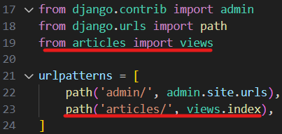
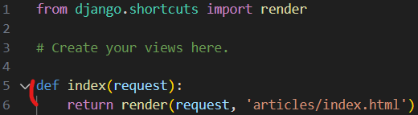
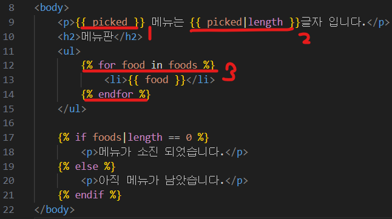
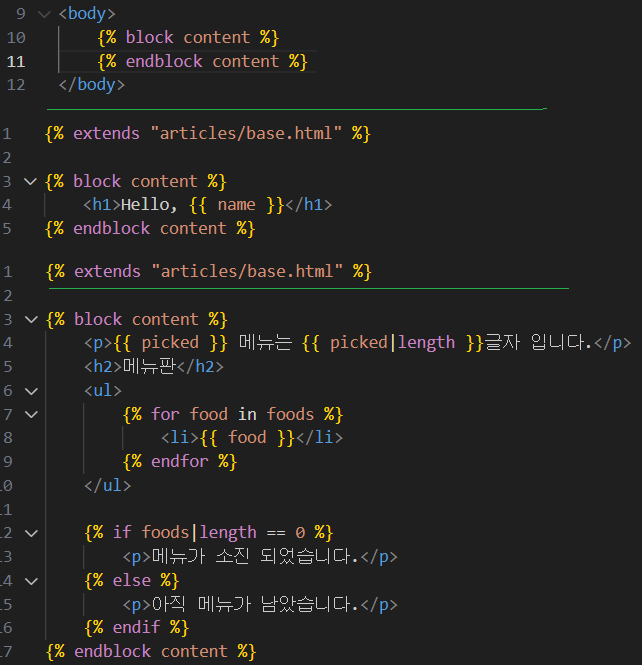

# Framework
- 웹 애플리케이션을 빠르게 개발할 수 있도록 도와주는 도구

# Django
- Python 기반의 대표적인 웹 프레임워크

# Client 클라이언트
- 서비스를 요청하는 주체, request, 웹 브라우저

# Server 서버
- 클라이언트의 요청에 응답하는 주체, response

### Django를 사용해 서버를 구현


# 가상환경
- 패키지 버전 격리, 독립적인 실행 환경, 충돌 방지

```
- 가상환경 venv 생성
$ python -m venv venv

- 가상환경 활성화
$ source venv/Scripts/activate
```

```
- 패키지 목록 확인
$ pip list

- 의존성 패키지 목록 생성
$ pip freeze > requirements.txt

- 패키지 목록 불러와 설치
$ pip install -r requirements.txt
```

```
- 프로젝트 생성, 마지막 . 주의
$ django-admin startproject 프로젝트이름 .

- 서버 실행
$ python manage.py runserver
```

# Django 프로젝트 생성 루틴
1. 가상환경 생성
2. 가상환경 활성화
3. Django 설치
4. 의존성 파일 생성
5. .gitignore 파일 생성
6. git 저장소 생성
7. Django 프로젝트 생성

# Django project
- 애플리케이션의 집합

# Django application
- 독립적을 작동하는 기능 단위 모듈

```
- 앱 생성   # 보통 articles
$ python manage.py startapp 앱이름

- 앱 등록
    - 반드시 앱 생성 후 등록

# settings.py
INSTALLED_APPS = [
    'articles',
    장고 기본 앱들,
]
```


# MTV 디자인 패턴, model, template, view
- Django에서 애플리케이션을 구조화하는 패턴

# 프로젝트 구조
## settings.py
- 프로젝트의 모든 설정을 관리
## urls.py
- URL과 이에 해당하는 적절한 views를 연결

# 앱구조
## admin.py
- 관리자용 페이지 설정
## models.py
- DB와 관련된 Model을 정의
## views.py
- HTTP 요청을 처리하고 해당 요청에 대한 응답을 반환

## url
- views 모듈의 index 뷰 함수를 호출


## view
- 응답 객체를 반환하는 index view 함수 정의


# Template
1. aritles 앱 폴더 안에 templates 폴더 생성
2. templates 폴더 안에 articles 폴더 생성
3. aritlces 폴더 안에 템플릿 파일 생성

# DTL, Django Template Language
1. Variable
- 딕셔너리 데이터 사용, key에 해당하는 변수명 출력
    - {{ variable }}
2. Filters
- 표시할 변수를 수정
    - {{ variable | filter }}
3. Tags
- 반복, 논리 수행, 제어 흐름
    - 
4. Comments
- 주석, 그냥 ctrl + / 쓰기




# 템플릿 상속
- 페이지의 공통요소를 포함
- 하위 템플릿이 재정의 할 수 있는 공간



# 'extends' tag
- 자식이 부모 템플릿을 확장, 반드시 최상단, 2개 이상 사용 불가
    - 

# 'block' tag
- 하위 템플릿이 작성할 수 있는 공간 지정
    - 

# 'form' element
- 사용자로부터 할당된 데이터를 서버로 전송

# action, method
- action
    - 입력 데이터가 전송될 URL 지정
- method
    - 어떤 방식으로 보낼지(GET, POST)

# 'input' element
- 사용자의 데이터를 입력 받는 요소

# 'name' attribute
- 입력한 데이터에 붙이는 이름

# form 데이터를 가져오는 방법
- request.GET.get('message')

